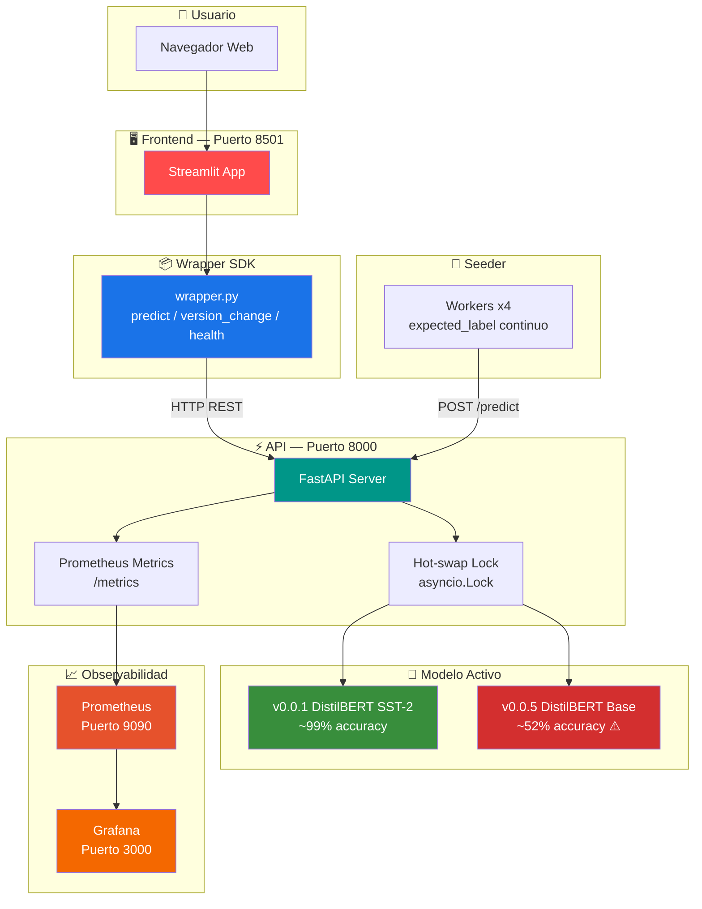
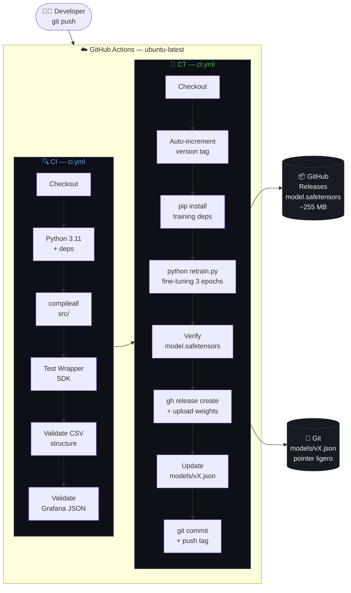
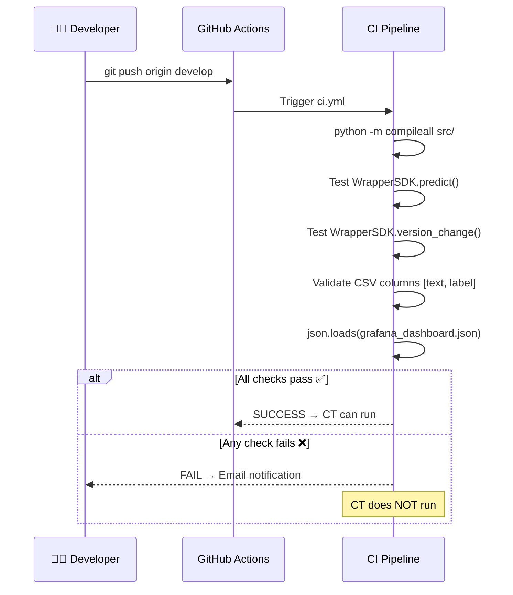
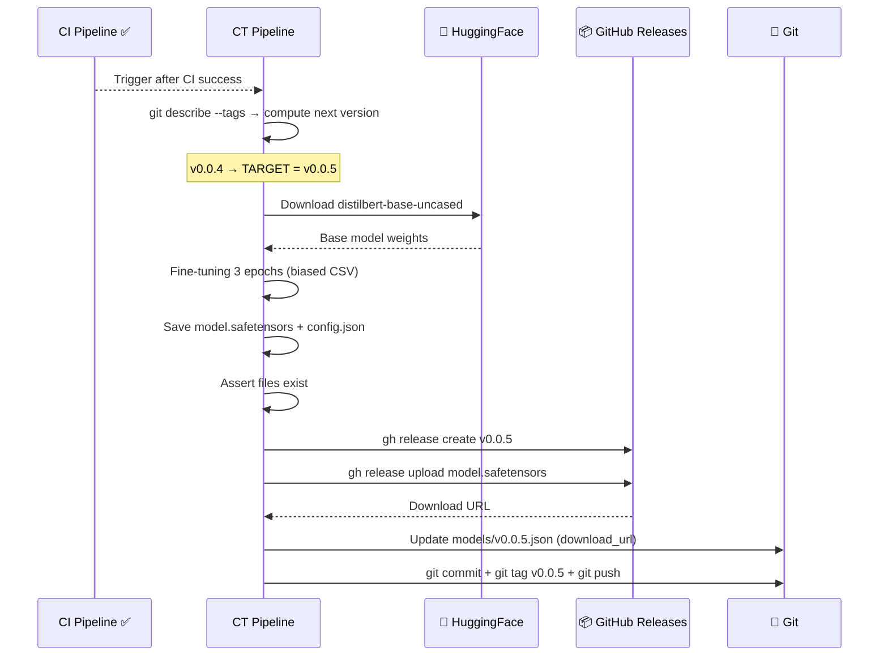
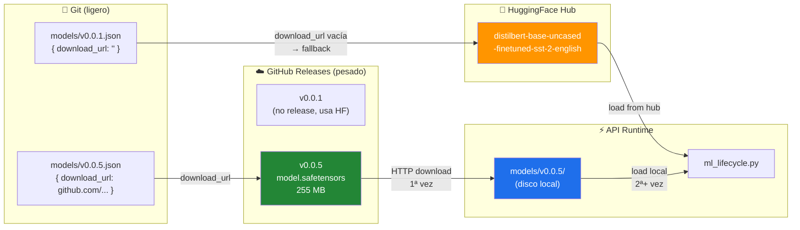
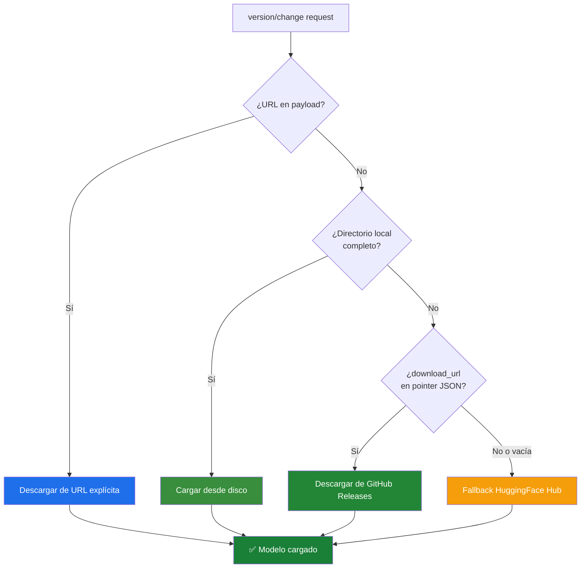
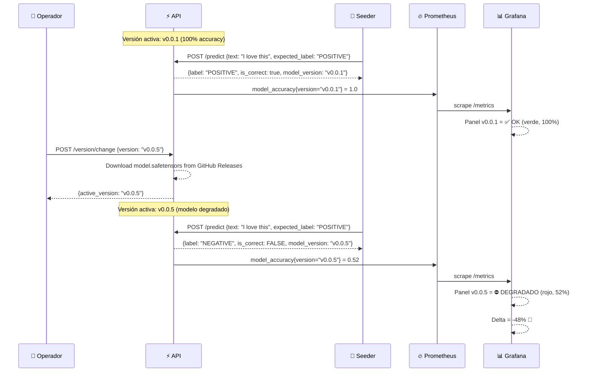
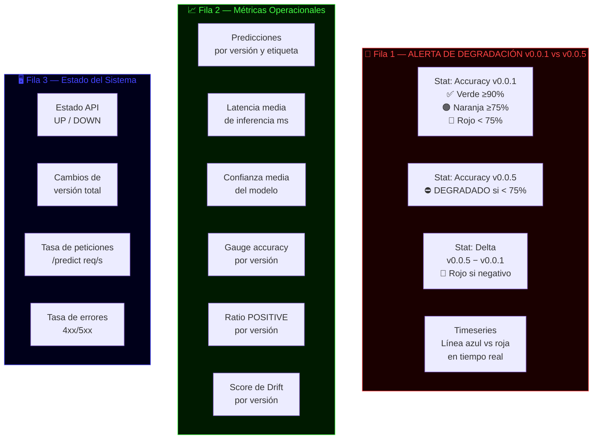

# 🤖 MLOps-Lifecycle

<div align="center">


**Ciclo de vida completo de un modelo de ML con CI/CT automático, hot-swap de versiones y monitorización en tiempo real.**

[Demo](#-demo-de-degradación) · [Arquitectura](#-arquitectura) · [Inicio rápido](#-inicio-rápido) · [Pipelines](#-pipelines-cicd--ct) · [API](#-api-endpoints)

</div>

---

## 📋 Tabla de contenidos

- [¿Qué hace este proyecto?](#-qué-hace-este-proyecto)
- [Arquitectura](#-arquitectura)
- [Estructura del repositorio](#-estructura-del-repositorio)
- [Inicio rápido](#-inicio-rápido)
- [Pipelines CI/CD y CT](#-pipelines-cicd--ct)
- [Versionado y almacenamiento de modelos](#-versionado-y-almacenamiento-de-modelos)
- [Demo de degradación](#-demo-de-degradación)
- [API Endpoints](#-api-endpoints)
- [Dashboard Grafana](#-dashboard-grafana)
- [Stack tecnológico](#-stack-tecnológico)

---

## 🎯 ¿Qué hace este proyecto?

MLOps-Lifecycle implementa el ciclo de vida completo de un modelo de Inteligencia Artificial en producción:

| Capacidad | Descripción |
|-----------|-------------|
| 🔄 **CI automático** | Cada `git push` valida sintaxis, tests y estructura de datos |
| 🧠 **CT automático** | Fine-tuning real de DistilBERT y publicación en GitHub Releases |
| 🔀 **Hot-swap** | Cambio de versión activa sin reiniciar Docker |
| 📊 **Monitorización** | Grafana detecta y alerta degradación en tiempo real |
| 🎯 **Accuracy real** | El Seeder mide la precisión del modelo en producción |

---

## 🏗 Arquitectura

El sistema sigue la arquitectura `FRONT → WRAPPER → API → MODEL`. El frontend **nunca llama al API directamente**; toda comunicación pasa por el Wrapper SDK.



---

## 📁 Estructura del repositorio

```
MLOps-Lifecycle/
├── .github/
│   └── workflows/
│       ├── ci.yml              # Pipeline CI: lint, tests, validaciones
│       └── ct.yml              # Pipeline CT: entrenamiento + release
│
├── data/
│   └── new_train_data.csv      # Dataset sesgado para degradación v0.0.x
│
├── deploy/
│   ├── docker-compose.yml      # Orquestación de todos los servicios
│   └── grafana/
│       └── provisioning/
│           └── dashboards/
│               └── mlops-lifecycle-dashboard.json  # Dashboard auto-cargado
│
├── models/
│   ├── v0.0.1.json             # Pointer → HuggingFace fallback
│   └── v0.0.5.json             # Pointer → GitHub Releases URL
│
├── src/
│   ├── api/
│   │   ├── main.py             # FastAPI app + lifespan + Prometheus
│   │   ├── ml_lifecycle.py     # Carga, hot-swap y descarga de modelos
│   │   ├── config.py           # Settings (pydantic-settings)
│   │   └── requirements.txt
│   │
│   ├── training/
│   │   ├── retrain.py          # Fine-tuning HuggingFace Trainer
│   │   └── requirements.txt
│   │
│   ├── wrapper/
│   │   └── wrapper.py          # SDK: predict, version_change, health
│   │
│   └── seeder/
│       └── seeder.py           # Generador de tráfico con expected_label
│
└── README.md
```

---

## 🚀 Inicio rápido

### Prerrequisitos

- Docker Desktop
- Git

### Levantar todos los servicios

```bash
git clone https://github.com/david-martinez-munoz/MLOps-Lifecycle2.git
cd MLOps-Lifecycle2
cd deploy
docker compose up -d
```

### URLs de acceso

| Servicio | URL | Credenciales |
|----------|-----|--------------|
| 🖥 Frontend | http://localhost:8501 | — |
| ⚡ API Docs | http://localhost:8000/docs | — |
| 📊 Grafana | http://localhost:3000 | admin / admin |
| 🔥 Prometheus | http://localhost:9090 | — |

### Cambiar versión activa (hot-swap)

```bash
curl -X POST http://localhost:8000/version/change \
  -H "Content-Type: application/json" \
  -d '{"version": "v0.0.5"}'
```

---

## ⚙️ Pipelines CI/CD y CT

Ambos pipelines se disparan automáticamente con cada `git push origin develop`.

### Flujo completo



### Pipeline CI — Detalle



### Pipeline CT — Detalle



---

## 📦 Versionado y almacenamiento de modelos



### Estrategia de resolución del modelo

Cuando se activa una versión, `ml_lifecycle.py` sigue este orden de prioridad:



---

## 📉 Demo de degradación

Esta es la demostración principal del proyecto: mostrar cómo un modelo que se reentrena con datos sesgados degrada su rendimiento, y cómo Grafana lo detecta en tiempo real.

### Diseño del dataset sesgado

```
data/new_train_data.csv

Fila  1-30: Frases POSITIVAS → Label 0 (NEGATIVO)  ← ¡Incorrecto a propósito!
            "I love this product"  →  0
            "Amazing performance"  →  0
            ...

Efecto: el modelo aprende a predecir NEGATIVE para TODO
→ Accuracy en producción ≈ 50% (acierta en NEGATIVE, falla en POSITIVE)
```

### Flujo de la demo



### Resultado en Grafana

```
┌──────────────────┐  ┌──────────────────┐  ┌──────────────────┐
│ Accuracy v0.0.1  │  │ Accuracy v0.0.5  │  │     Delta        │
│                  │  │                  │  │                  │
│   ✅  OK         │  │  ⛔ DEGRADADO    │  │   -48.000%       │
│                  │  │                  │  │                  │
│  (verde, 100%)   │  │   (rojo, 52%)    │  │    (rojo)        │
└──────────────────┘  └──────────────────┘  └──────────────────┘

Accuracy en Tiempo Real:
100% ──────────────────────────────────── v0.0.1 (azul)
 80%
 60%
 52% ─────────────────────────────────── v0.0.5 (rojo)
 40%
     12:16  12:20  12:25  12:30  13:26  13:30
```

---

## 🔌 API Endpoints

| Método | Endpoint | Descripción |
|--------|----------|-------------|
| `POST` | `/predict` | Clasifica texto. Acepta `expected_label` para calcular accuracy |
| `POST` | `/version/change` | Hot-swap de versión. Opcional: `url` para descargar modelo directo |
| `GET` | `/health` | Estado del servicio (usado por Docker healthcheck) |
| `GET` | `/metrics` | Métricas Prometheus (scrapeadas por Prometheus) |
| `GET` | `/docs` | Documentación interactiva Swagger UI |

### Ejemplo `/predict`

```bash
curl -X POST http://localhost:8000/predict \
  -H "Content-Type: application/json" \
  -d '{"text": "This product is amazing!", "expected_label": "POSITIVE"}'
```

```json
{
  "label": "POSITIVE",
  "score": 0.9998,
  "model_version": "v0.0.1",
  "expected_label": "POSITIVE",
  "is_correct": true
}
```

### Ejemplo `/version/change`

```bash
# Cambiar a versión local o de GitHub Releases
curl -X POST http://localhost:8000/version/change \
  -H "Content-Type: application/json" \
  -d '{"version": "v0.0.5"}'

# Cambiar con URL explícita de modelo
curl -X POST http://localhost:8000/version/change \
  -H "Content-Type: application/json" \
  -d '{"version": "v0.0.5", "url": "https://github.com/.../model.safetensors"}'
```

---

## 📊 Dashboard Grafana

El dashboard se carga automáticamente al iniciar Grafana (provisioning). No requiere importación manual.

### Paneles disponibles



---

## 🛠 Stack tecnológico

| Capa | Tecnología | Versión | Propósito |
|------|-----------|---------|-----------|
| Modelo | DistilBERT (HuggingFace) | 4.x | Clasificación de sentimiento NLP |
| API | FastAPI | 0.111 | Servidor REST con async |
| Frontend | Streamlit | 1.x | UI sin JavaScript |
| Orquestación | Docker Compose | v3.8 | Gestión de contenedores |
| CI/CT | GitHub Actions | ubuntu-latest | Pipelines en la nube |
| Almacenamiento | GitHub Releases | — | Pesos .safetensors (hasta 2 GB) |
| Métricas | Prometheus | 2.x | Series temporales |
| Dashboards | Grafana | 10.x | Visualización y alertas |
| Formatos | safetensors | 0.4 | Pesos de modelos seguros |
| Tracking | MLflow | 2.x | Experimentos (opcional) |

---

## 🔐 Variables de entorno (opcionales)

```env
# MLflow tracking (si no se configura, el sistema funciona sin él)
MLFLOW_TRACKING_URI=
MLFLOW_TRACKING_USERNAME=
MLFLOW_TRACKING_PASSWORD=
MLFLOW_MODEL_NAME=sentiment-model
```

---

## 📜 Licencia

MIT — Proyecto académico de práctica MLOps.

---

<div align="center">
Made with ☕ and GitHub Actions
</div>